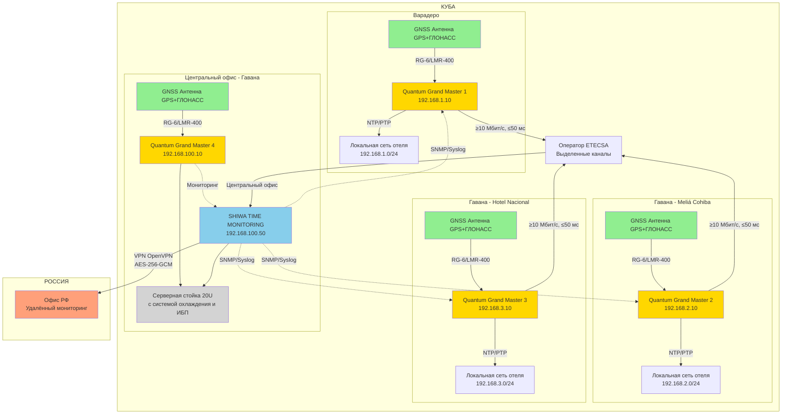
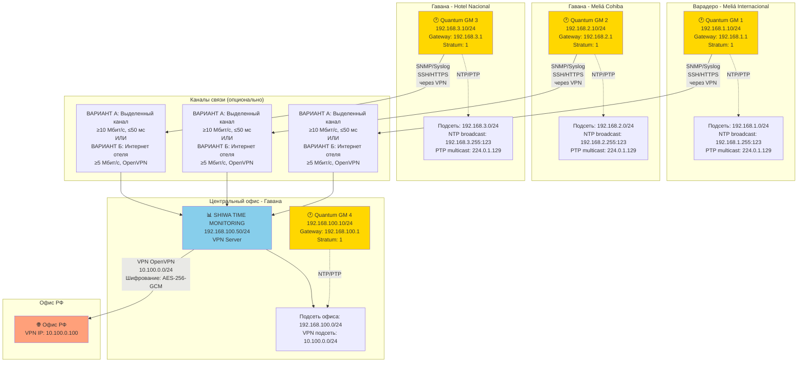
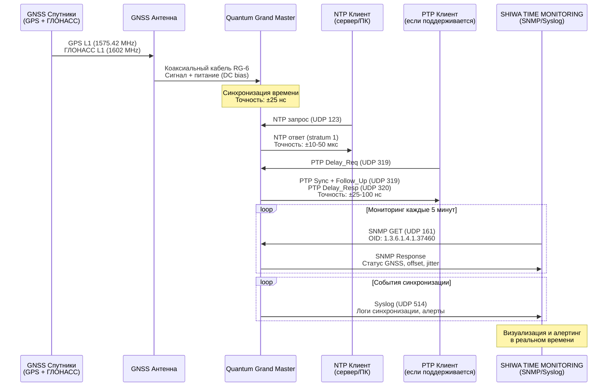
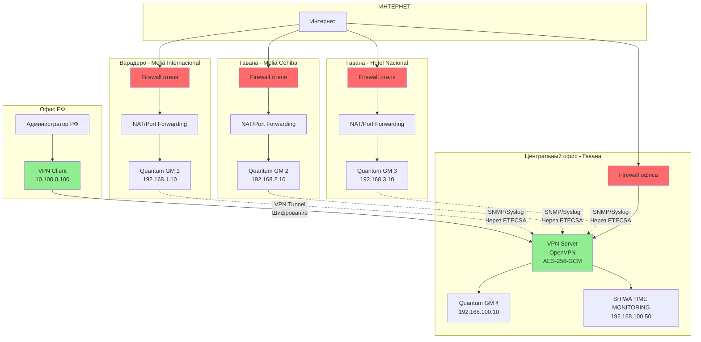

# 📊 Сетевые диаграммы системы точного времени

## 📑 Содержание

1. [Общая архитектура системы](#1-общая-архитектура-системы)
2. [Физическая топология](#2-физическая-топология)
3. [Логическая топология и IP-адресация](#3-логическая-топология-и-ip-адресация)
4. [Диаграмма потоков данных](#4-диаграмма-потоков-данных)
5. [Архитектура мониторинга](#5-архитектура-мониторинга)
6. [Схема резервирования и failover](#6-схема-резервирования-и-failover)
7. [Диаграмма безопасности и VPN](#7-диаграмма-безопасности-и-vpn)

---

## 1. Общая архитектура системы



---

## 2. Физическая топология

### 2.1 Типовое размещение оборудования в отеле

```
┌─────────────────────────────────────────────────────────────────┐
│                        КРЫША ОТЕЛЯ                               │
│                                                                   │
│  ┌────────────────┐                                              │
│  │ GNSS Антенна   │  ← GPS L1 (1575.42 MHz)                     │
│  │ GPS + ГЛОНАСС  │  ← ГЛОНАСС L1 (1602 MHz)                    │
│  │  (активная)    │                                              │
│  │  Усиление: 30dB│                                              │
│  └────────┬───────┘                                              │
│           │                                                       │
│           │ Коаксиальный кабель RG-6 / LMR-400                  │
│           │ Длина: ≤25 метров                                    │
│           │ N-type коннекторы                                    │
│           │                                                       │
│  ┌────────▼───────┐                                              │
│  │  Грозозащита   │  ← Защита от импульсных перенапряжений      │
│  │     (SPD)      │     Установка НА КРЫШЕ рядом с антенной     │
│  └────────┬───────┘                                              │
└───────────┼───────────────────────────────────────────────────────┘
            │
            │ Кабельная трасса
            │ (существующая или новая)
            ↓
┌─────────────────────────────────────────────────────────────────┐
│                   СЕРВЕРНАЯ / ИТ-ПОМЕЩЕНИЕ                       │
│                                                                   │
│        │                                                          │
│  ┌─────▼──────────────────────────────────────────────────────┐ │
│  │          19" СТОЙКА или Настенное крепление               │ │
│  │                                                             │ │
│  │  ┌────────────────────────────────────────────────────┐   │ │
│  │  │    Quantum Grand Master Mini PTP (1U)              │   │ │
│  │  │  ┌──────────┐  ┌───────────┐  ┌────────────┐      │   │ │
│  │  │  │ GNSS IN  │  │   GbE 1   │  │   GbE 2    │      │   │ │
│  │  │  │   SMA    │  │  RJ-45    │  │  RJ-45     │      │   │ │
│  │  │  └────▲─────┘  └─────┬─────┘  └──────┬─────┘      │   │ │
│  │  │       │              │                │            │   │ │
│  │  │       │              │                │  (резерв)  │   │ │
│  │  └───────┼──────────────┼────────────────┼────────────┘   │ │
│  │          │              │                │                │ │
│  │  От крыши (через SPD) К коммутатору      │                │ │
│  └──────────────────────────────────────────────────────────┘ │
│                                                                 │
│  ┌─────────────────────────────────────┐                       │
│  │  Коммутатор отеля                   │                       │
│  │  (IGMP snooping enabled)            │                       │
│  │  (QoS for PTP: приоритет)           │                       │
│  └────────────┬────────────────────────┘                       │
│               │                                                 │
│               └─► К локальной сети отеля (серверы, ПК, POS)   │
│                                                                 │
│  ┌─────────────────────────┐                                   │
│  │  Розетка 220V 60 Гц     │  ← Электропитание                │
│  │  с заземлением          │                                   │
│  └─────────────────────────┘                                   │
└─────────────────────────────────────────────────────────────────┘
```

### 2.2 Серверная стойка в центральном офисе Гаваны

```
┌─────────────────────────────────────────────────────────────────┐
│              СЕРВЕРНАЯ СТОЙКА 19" 20U                            │
│                                                                   │
│  ┌──────────────────────────────────────────────────────┐       │
│  │ 1U  │ KVM-консоль (клавиатура, монитор, мышь)        │       │
│  ├──────────────────────────────────────────────────────┤       │
│  │ 2U  │ Quantum Grand Master 4 (сервер времени)        │       │
│  │     │ IP: 192.168.100.10/24                          │       │
│  │     │ GNSS IN: Антенна на крыше офиса               │       │
│  ├──────────────────────────────────────────────────────┤       │
│  │ 3U  │                                                 │       │
│  ├──────────────────────────────────────────────────────┤       │
│  │ 4U  │ SHIWA TIME MONITORING (Ubuntu 22.04 LTS)      │       │
│  │     │ IP: 192.168.100.50/24                          │       │
│  │     │ Zabbix Server + Grafana                        │       │
│  ├──────────────────────────────────────────────────────┤       │
│  │ 5U  │                                                 │       │
│  ├──────────────────────────────────────────────────────┤       │
│  │     │                (Резерв для расширения)         │       │
│  │ 6-15│                                                 │       │
│  │     │                                                 │       │
│  ├──────────────────────────────────────────────────────┤       │
│  │16-17│ Коммутатор (24 порта GbE)                      │       │
│  │     │ VLAN, IGMP snooping, QoS                       │       │
│  ├──────────────────────────────────────────────────────┤       │
│  │18-19│ ИБП (UPS) - 30 минут автономной работы         │       │
│  │     │ Защита от перебоев электропитания              │       │
│  ├──────────────────────────────────────────────────────┤       │
│  │ 20U │ Патч-панель и кабель-менеджмент                │       │
│  └──────────────────────────────────────────────────────┘       │
│                                                                   │
│  Система охлаждения:                                             │
│  ├─ Вентиляторы в серверах                                      │
│  ├─ Кондиционирование помещения (18-25°C)                       │
│  └─ Мониторинг температуры через SNMP                           │
│                                                                   │
│  Электропитание:                                                 │
│  ├─ Основное: 220V 60 Гц с заземлением                          │
│  ├─ Резервное: ИБП → 30 минут                                   │
│  └─ Опционально: Генератор (если доступен)                      │
└─────────────────────────────────────────────────────────────────┘
```

---

## 3. Логическая топология и IP-адресация



### 3.1 Таблица IP-адресов

| Локация | Устройство | IP-адрес | Маска | Gateway | DNS | Назначение |
|---------|------------|----------|-------|---------|-----|------------|
| **Варадеро** | Quantum GM 1 | 192.168.1.10 | /24 | 192.168.1.1 | [DNS отеля] | Grand Master 1 |
| **Гавана (Cohiba)** | Quantum GM 2 | 192.168.2.10 | /24 | 192.168.2.1 | [DNS отеля] | Grand Master 2 |
| **Гавана (Nacional)** | Quantum GM 3 | 192.168.3.10 | /24 | 192.168.3.1 | [DNS отеля] | Grand Master 3 |
| **Офис Гавана** | Quantum GM 4 | 192.168.100.10 | /24 | 192.168.100.1 | 8.8.8.8 | Grand Master 4 |
| **Офис Гавана** | SHIWA TIME MONITORING | 192.168.100.50 | /24 | 192.168.100.1 | 8.8.8.8 | Система мониторинга |
| **VPN подсеть** | VPN пул | 10.100.0.0 | /24 | 10.100.0.1 | - | VPN клиенты |
| **Офис РФ** | VPN клиент | 10.100.0.100 | /24 | 10.100.0.1 | - | Удалённый доступ |

---

## 4. Диаграмма потоков данных



### 4.1 Типы трафика и приоритеты

```
┌─────────────────────────────────────────────────────────────────┐
│                      ТИПЫ ТРАФИКА                                │
├─────────────────────────────────────────────────────────────────┤
│                                                                   │
│  1. PTP (IEEE 1588) - КРИТИЧЕСКИЙ ПРИОРИТЕТ                     │
│     ├─ UDP 319 (Event messages): Sync, Delay_Req, Follow_Up    │
│     ├─ UDP 320 (General messages): Announce, Management         │
│     ├─ Multicast: 224.0.1.129                                   │
│     ├─ QoS: DSCP EF (Expedited Forwarding)                      │
│     └─ Пропускная способность: ~1-10 пакетов/сек               │
│                                                                   │
│  2. NTP - ВЫСОКИЙ ПРИОРИТЕТ                                     │
│     ├─ UDP 123                                                   │
│     ├─ Broadcast: xxx.xxx.xxx.255:123                          │
│     ├─ QoS: DSCP AF41 (Assured Forwarding)                      │
│     └─ Пропускная способность: ~100-500 запросов/сек           │
│                                                                   │
│  3. SNMP - СРЕДНИЙ ПРИОРИТЕТ                                    │
│     ├─ UDP 161 (запросы к устройству)                          │
│     ├─ UDP 162 (traps от устройства)                           │
│     ├─ QoS: DSCP AF21                                           │
│     └─ Пропускная способность: ~1-10 запросов/мин              │
│                                                                   │
│  4. Syslog - СРЕДНИЙ ПРИОРИТЕТ                                  │
│     ├─ UDP 514                                                   │
│     ├─ QoS: DSCP AF21                                           │
│     └─ Пропускная способность: ~1-100 сообщений/час            │
│                                                                   │
│  5. Управление (SSH/HTTPS) - СРЕДНИЙ ПРИОРИТЕТ                  │
│     ├─ TCP 22 (SSH)                                             │
│     ├─ TCP 443 (HTTPS веб-интерфейс)                           │
│     ├─ QoS: DSCP AF31                                           │
│     └─ Пропускная способность: по требованию                    │
│                                                                   │
└─────────────────────────────────────────────────────────────────┘
```

---

## 5. Архитектура мониторинга

```mermaid
graph TB
    subgraph "Источники данных"
        GM1[Quantum GM 1<br/>Варадеро]
        GM2[Quantum GM 2<br/>Гавана Cohiba]
        GM3[Quantum GM 3<br/>Гавана Nacional]
        GM4[Quantum GM 4<br/>Офис Гавана]
    end
    
    subgraph "Центральный офис - Гавана"
        subgraph "SHIWA TIME MONITORING 192.168.100.50"
            ZABBIX[Сбор метрик SNMP<br/>Получение Syslog<br/>Алертинг<br/>(Zabbix)]
            GRAFANA[Визуализация<br/>Дашборды<br/>(Grafana)]
            DB[(PostgreSQL<br/>База данных<br/>метрик)]
            
            ZABBIX --> DB
            GRAFANA --> DB
        end
    end
    
    GM1 -->|SNMP UDP 161<br/>Каждые 5 мин| ZABBIX
    GM2 -->|SNMP UDP 161<br/>Каждые 5 мин| ZABBIX
    GM3 -->|SNMP UDP 161<br/>Каждые 5 мин| ZABBIX
    GM4 -->|SNMP UDP 161<br/>Каждые 5 мин| ZABBIX
    
    GM1 -.->|Syslog UDP 514<br/>События| ZABBIX
    GM2 -.->|Syslog UDP 514<br/>События| ZABBIX
    GM3 -.->|Syslog UDP 514<br/>События| ZABBIX
    GM4 -.->|Syslog UDP 514<br/>События| ZABBIX
    
    ZABBIX -->|Email/SMS| ALERTS[Система алертинга<br/>ИТ-персонал отелей]
    
    subgraph "Офис РФ"
        RF_ADMIN[Удалённый<br/>администратор]
    end
    
    GRAFANA -->|VPN HTTPS<br/>10.100.0.0/24| RF_ADMIN
    ZABBIX -->|VPN HTTPS<br/>10.100.0.0/24| RF_ADMIN

    style GM1 fill:#FFD700
    style GM2 fill:#FFD700
    style GM3 fill:#FFD700
    style GM4 fill:#FFD700
    style ZABBIX fill:#87CEEB
    style GRAFANA fill:#87CEEB
    style ALERTS fill:#FF6B6B
    style RF_ADMIN fill:#FFA07A
```

### 5.1 Собираемые метрики

```
┌─────────────────────────────────────────────────────────────────┐
│                    МЕТРИКИ МОНИТОРИНГА                           │
├─────────────────────────────────────────────────────────────────┤
│                                                                   │
│  📡 GNSS МЕТРИКИ (обновление каждые 5 мин)                      │
│     ├─ Количество видимых спутников (GPS, ГЛОНАСС)              │
│     ├─ SNR (отношение сигнал/шум) каждого спутника             │
│     ├─ DOP (Dilution of Precision): HDOP, VDOP, PDOP           │
│     ├─ Статус фиксации (No Fix / 2D Fix / 3D Fix)             │
│     ├─ Координаты антенны (широта, долгота, высота)            │
│     └─ Статус антенны (OK / Short / Open)                      │
│                                                                   │
│  ⏰ МЕТРИКИ СИНХРОНИЗАЦИИ (обновление каждую минуту)            │
│     ├─ NTP offset (смещение времени от UTC)                    │
│     ├─ NTP jitter (вариация задержки)                          │
│     ├─ PTP offset (смещение для PTP клиентов)                  │
│     ├─ Stratum (уровень стратума NTP)                          │
│     ├─ Количество NTP запросов/сек                             │
│     └─ Количество PTP клиентов                                 │
│                                                                   │
│  🖥️ СИСТЕМНЫЕ МЕТРИКИ (обновление каждую минуту)               │
│     ├─ CPU utilization (%)                                      │
│     ├─ Memory usage (MB / %)                                    │
│     ├─ Disk usage (GB / %)                                      │
│     ├─ Network traffic (Mbps, packets/sec)                      │
│     ├─ Temperature (°C)                                         │
│     └─ Uptime (дни)                                             │
│                                                                   │
│  🔔 АЛЕРТЫ (немедленно при событии)                             │
│     ├─ Потеря GNSS сигнала >5 минут                            │
│     ├─ Количество спутников <4                                 │
│     ├─ NTP offset >100 мс                                       │
│     ├─ Недоступность устройства >2 минут                       │
│     ├─ Температура >60°C                                        │
│     ├─ Проблемы с антенной (short/open)                        │
│     └─ Перезагрузка устройства                                 │
│                                                                   │
└─────────────────────────────────────────────────────────────────┘
```

---

## 6. Схема резервирования и failover

```mermaid
graph TB
    subgraph "Сценарий 1: Потеря GNSS"
        GNSS_OK[GNSS сигнал OK<br/>Точность: ±25 нс]
        GNSS_LOST[Потеря GNSS >30 мин]
        HOLDOVER[Режим Holdover<br/>Точность: ±1 мс/24ч]
        EXT_NTP[Внешние NTP сервера<br/>Stratum 2, ±50 мс]
        
        GNSS_OK -->|Сбой спутников| GNSS_LOST
        GNSS_LOST --> HOLDOVER
        HOLDOVER -->|Если >24ч| EXT_NTP
        GNSS_LOST -.->|Алерт в течение 5 мин| ADMIN1[Уведомление<br/>администратора]
    end
    
    subgraph "Сценарий 2: Потеря сети"
        NET_OK[Сеть OK<br/>Связь с мониторингом]
        NET_LOST[Потеря связи >15 мин]
        LOCAL_LOG[Локальное логирование<br/>Сохранение данных ≥7 дней]
        NET_RESTORE[Восстановление связи]
        SYNC_LOG[Синхронизация логов<br/>с сервером мониторинга]
        
        NET_OK -->|Сбой канала| NET_LOST
        NET_LOST --> LOCAL_LOG
        NET_LOST -.->|SMS алерт| ADMIN2[Уведомление<br/>администратора]
        LOCAL_LOG --> NET_RESTORE
        NET_RESTORE --> SYNC_LOG
    end
    
    subgraph "Сценарий 3: Отказ оборудования"
        HW_OK[Оборудование OK]
        HW_FAIL[Отказ Quantum GM]
        SPARE[Запасные части<br/>в центральном офисе]
        TEMP_NTP[Временное решение:<br/>внешние NTP сервера]
        RMA[RMA процедура<br/>Замена оборудования<br/>2-4 недели]
        
        HW_OK -->|Аппаратный сбой| HW_FAIL
        HW_FAIL -->|Немедленно| TEMP_NTP
        HW_FAIL -->|Использование| SPARE
        HW_FAIL -.->|Критический алерт| ADMIN3[Уведомление<br/>администратора]
        HW_FAIL -->|Запуск| RMA
    end
    
    subgraph "Сценарий 4: Потеря электропитания"
        POWER_OK[Электропитание OK<br/>220V 60 Гц]
        POWER_LOST[Отключение питания]
        UPS[ИБП (UPS)<br/>Автономная работа<br/>30 минут]
        SHUTDOWN[Корректное выключение<br/>Сохранение настроек]
        POWER_RESTORE[Восстановление питания]
        AUTO_START[Автоматический запуск<br/>Восстановление синхронизации<br/>~15-30 минут]
        
        POWER_OK -->|Сбой электросети| POWER_LOST
        POWER_LOST --> UPS
        UPS -->|Если >30 мин| SHUTDOWN
        POWER_LOST -.->|Алерт| ADMIN4[Уведомление<br/>администратора]
        SHUTDOWN --> POWER_RESTORE
        POWER_RESTORE --> AUTO_START
    end

    style GNSS_LOST fill:#FF6B6B
    style NET_LOST fill:#FF6B6B
    style HW_FAIL fill:#FF6B6B
    style POWER_LOST fill:#FF6B6B
    style ADMIN1 fill:#FFA07A
    style ADMIN2 fill:#FFA07A
    style ADMIN3 fill:#FFA07A
    style ADMIN4 fill:#FFA07A
```

### 6.1 Таблица времени восстановления (RTO)

| Сценарий | Время обнаружения | Время реакции | RTO (Recovery Time Objective) | RPO (Recovery Point Objective) |
|----------|-------------------|---------------|-------------------------------|-------------------------------|
| **Потеря GNSS** | ≤5 минут | ≤15 минут | Holdover: немедленно<br/>Внешний NTP: 5 минут | 0 (без потери данных) |
| **Потеря сети** | ≤5 минут | ≤30 минут | Локальная работа: немедленно<br/>Синхронизация: автоматически | 0 (логи сохраняются локально) |
| **Отказ оборудования** | ≤2 минуты | ≤1 час | Запасные части: 2-4 часа<br/>RMA: 2-4 недели | 0 (настройки в бэкапе) |
| **Отключение питания** | Немедленно | ≤30 минут | UPS: 30 минут<br/>Автозапуск: 15-30 минут | 0 (настройки сохраняются) |

---

## 7. Диаграмма безопасности и VPN



### 7.1 Правила Firewall

```
┌─────────────────────────────────────────────────────────────────┐
│                   ПРАВИЛА FIREWALL                               │
├─────────────────────────────────────────────────────────────────┤
│                                                                   │
│  🔒 ВХОДЯЩИЙ ТРАФИК (Inbound)                                   │
│                                                                   │
│  ┌─────────────────────────────────────────────────────────────┐│
│  │ Правило 1: SSH (Удалённое управление)                       ││
│  │  ├─ Источник: Офис Гавана (VPN подсеть 10.100.0.0/24)      ││
│  │  ├─ Назначение: Quantum GM (192.168.X.10)                   ││
│  │  ├─ Протокол: TCP                                            ││
│  │  ├─ Порт: 22                                                 ││
│  │  ├─ Действие: РАЗРЕШИТЬ                                     ││
│  │  └─ Логирование: Включено                                   ││
│  └─────────────────────────────────────────────────────────────┘│
│                                                                   │
│  ┌─────────────────────────────────────────────────────────────┐│
│  │ Правило 2: HTTPS (Веб-интерфейс)                            ││
│  │  ├─ Источник: Офис Гавана (VPN подсеть 10.100.0.0/24)      ││
│  │  ├─ Назначение: Quantum GM (192.168.X.10)                   ││
│  │  ├─ Протокол: TCP                                            ││
│  │  ├─ Порт: 443                                                ││
│  │  ├─ Действие: РАЗРЕШИТЬ                                     ││
│  │  └─ Логирование: Включено                                   ││
│  └─────────────────────────────────────────────────────────────┘│
│                                                                   │
│  ┌─────────────────────────────────────────────────────────────┐│
│  │ Правило 3: SNMP (Мониторинг)                                ││
│  │  ├─ Источник: SHIWA TIME MONITORING (192.168.100.50)       ││
│  │  ├─ Назначение: Quantum GM (192.168.X.10)                   ││
│  │  ├─ Протокол: UDP                                            ││
│  │  ├─ Порт: 161                                                ││
│  │  ├─ Действие: РАЗРЕШИТЬ                                     ││
│  │  └─ Логирование: Выключено (много запросов)                ││
│  └─────────────────────────────────────────────────────────────┘│
│                                                                   │
│  ┌─────────────────────────────────────────────────────────────┐│
│  │ Правило 4: NTP (Синхронизация локальная)                    ││
│  │  ├─ Источник: Локальная сеть (192.168.X.0/24)              ││
│  │  ├─ Назначение: Quantum GM (192.168.X.10)                   ││
│  │  ├─ Протокол: UDP                                            ││
│  │  ├─ Порт: 123                                                ││
│  │  ├─ Действие: РАЗРЕШИТЬ                                     ││
│  │  └─ Логирование: Выключено (высокая частота)               ││
│  └─────────────────────────────────────────────────────────────┘│
│                                                                   │
│  ┌─────────────────────────────────────────────────────────────┐│
│  │ Правило 5: PTP (Синхронизация локальная)                    ││
│  │  ├─ Источник: Локальная сеть (192.168.X.0/24)              ││
│  │  ├─ Назначение: Quantum GM (192.168.X.10)                   ││
│  │  ├─ Протокол: UDP                                            ││
│  │  ├─ Порты: 319, 320                                          ││
│  │  ├─ Действие: РАЗРЕШИТЬ                                     ││
│  │  └─ Логирование: Выключено (высокая частота)               ││
│  └─────────────────────────────────────────────────────────────┘│
│                                                                   │
│  ┌─────────────────────────────────────────────────────────────┐│
│  │ Правило 6: Всё остальное                                     ││
│  │  ├─ Источник: Любой                                          ││
│  │  ├─ Назначение: Quantum GM (192.168.X.10)                   ││
│  │  ├─ Протокол: Любой                                          ││
│  │  ├─ Порт: Любой                                              ││
│  │  ├─ Действие: ЗАПРЕТИТЬ                                     ││
│  │  └─ Логирование: Включено (попытки атак)                   ││
│  └─────────────────────────────────────────────────────────────┘│
│                                                                   │
│  🔓 ИСХОДЯЩИЙ ТРАФИК (Outbound)                                 │
│                                                                   │
│  ┌─────────────────────────────────────────────────────────────┐│
│  │ Правило 7: Syslog (Логирование)                             ││
│  │  ├─ Источник: Quantum GM (192.168.X.10)                     ││
│  │  ├─ Назначение: SHIWA TIME MONITORING (192.168.100.50)     ││
│  │  ├─ Протокол: UDP                                            ││
│  │  ├─ Порт: 514                                                ││
│  │  ├─ Действие: РАЗРЕШИТЬ                                     ││
│  │  └─ Логирование: Выключено                                  ││
│  └─────────────────────────────────────────────────────────────┘│
│                                                                   │
│  ┌─────────────────────────────────────────────────────────────┐│
│  │ Правило 8: SNMP Traps (Алерты)                              ││
│  │  ├─ Источник: Quantum GM (192.168.X.10)                     ││
│  │  ├─ Назначение: SHIWA TIME MONITORING (192.168.100.50)     ││
│  │  ├─ Протокол: UDP                                            ││
│  │  ├─ Порт: 162                                                ││
│  │  ├─ Действие: РАЗРЕШИТЬ                                     ││
│  │  └─ Логирование: Включено                                   ││
│  └─────────────────────────────────────────────────────────────┘│
│                                                                   │
│  ┌─────────────────────────────────────────────────────────────┐│
│  │ Правило 9: DNS (Резолвинг имён)                             ││
│  │  ├─ Источник: Quantum GM (192.168.X.10)                     ││
│  │  ├─ Назначение: DNS-сервер отеля                            ││
│  │  ├─ Протокол: UDP                                            ││
│  │  ├─ Порт: 53                                                 ││
│  │  ├─ Действие: РАЗРЕШИТЬ                                     ││
│  │  └─ Логирование: Выключено                                  ││
│  └─────────────────────────────────────────────────────────────┘│
│                                                                   │
│  ┌─────────────────────────────────────────────────────────────┐│
│  │ Правило 10: Всё остальное                                    ││
│  │  ├─ Источник: Quantum GM (192.168.X.10)                     ││
│  │  ├─ Назначение: Любой                                        ││
│  │  ├─ Протокол: Любой                                          ││
│  │  ├─ Порт: Любой                                              ││
│  │  ├─ Действие: ЗАПРЕТИТЬ                                     ││
│  │  └─ Логирование: Включено                                   ││
│  └─────────────────────────────────────────────────────────────┘│
│                                                                   │
└─────────────────────────────────────────────────────────────────┘
```

### 7.2 VPN конфигурация

```
┌─────────────────────────────────────────────────────────────────┐
│                    VPN КОНФИГУРАЦИЯ                              │
├─────────────────────────────────────────────────────────────────┤
│                                                                   │
│  🔐 ПАРАМЕТРЫ VPN (OpenVPN)                                      │
│                                                                   │
│  Тип VPN: Site-to-Site VPN                                       │
│  Протокол: OpenVPN (TCP или UDP)                                 │
│                                                                   │
│  ┌─────────────────────────────────────────────────────────────┐│
│  │ OpenVPN - Рекомендуемая конфигурация                        ││
│  │                                                               ││
│  │  Основные параметры:                                          ││
│  │  ├─ Протокол: UDP 1194 (стандартный порт)                   ││
│  │  ├─ Режим: TUN (маршрутизируемый IP туннель)                ││
│  │  ├─ Encryption: AES-256-GCM                                  ││
│  │  ├─ Authentication: HMAC SHA-256                             ││
│  │  ├─ Control Channel: TLS 1.3                                 ││
│  │  ├─ DH Key: 2048-bit (или ECDH)                             ││
│  │  └─ Compression: LZ4 (опционально)                          ││
│  │                                                               ││
│  │  Аутентификация:                                              ││
│  │  ├─ Метод: Сертификаты X.509 (RSA 2048-bit)                ││
│  │  ├─ CA: Центр сертификации для выдачи сертификатов         ││
│  │  ├─ Server Certificate: Сертификат сервера                  ││
│  │  ├─ Client Certificates: Индивидуальные сертификаты        ││
│  │  └─ TLS Auth: Дополнительный ключ HMAC для защиты          ││
│  │                                                               ││
│  │  Безопасность:                                                ││
│  │  ├─ Cipher: AES-256-GCM (без CBC уязвимостей)              ││
│  │  ├─ TLS Version: TLS 1.3 (минимум TLS 1.2)                 ││
│  │  ├─ Perfect Forward Secrecy (PFS): Включено                 ││
│  │  ├─ Keepalive: 10 секунд ping, 60 секунд timeout           ││
│  │  └─ MTU: 1500 (с fragment 1300 для избежания проблем)      ││
│  │                                                               ││
│  │  Сетевые настройки:                                           ││
│  │  ├─ Подсеть туннеля: 10.100.0.0/24                          ││
│  │  ├─ Server IP: 10.100.0.1                                    ││
│  │  ├─ Push routes: Маршруты к локальным сетям отелей         ││
│  │  └─ DNS: Push DNS серверов для клиентов                     ││
│  └─────────────────────────────────────────────────────────────┘│
│                                                                   │
│  📡 VPN ПОДСЕТЬ                                                  │
│                                                                   │
│  Подсеть VPN: 10.100.0.0/24                                      │
│  Gateway: 10.100.0.1 (VPN Server в офисе Гаваны)                │
│                                                                   │
│  Адресация:                                                       │
│  ├─ 10.100.0.1   - VPN Server (офис Гавана)                     │
│  ├─ 10.100.0.10  - Quantum GM 1 (Варадеро) - туннель            │
│  ├─ 10.100.0.20  - Quantum GM 2 (Гавана Cohiba) - туннель       │
│  ├─ 10.100.0.30  - Quantum GM 3 (Гавана Nacional) - туннель     │
│  ├─ 10.100.0.40  - Quantum GM 4 (офис Гавана) - локально        │
│  ├─ 10.100.0.50  - SHIWA TIME MONITORING - локально             │
│  └─ 10.100.0.100 - VPN Client (офис РФ)                         │
│                                                                   │
│  🔄 МАРШРУТИЗАЦИЯ                                                │
│                                                                   │
│  Офис РФ (10.100.0.100) может достучаться до:                   │
│  ├─ Все Quantum GM через VPN (10.100.0.10-40)                   │
│  ├─ SHIWA TIME MONITORING (10.100.0.50)                         │
│  ├─ Веб-интерфейс системы мониторинга (HTTPS)                   │
│  └─ SSH к любому Quantum GM для управления                       │
│                                                                   │
│  🔒 БЕЗОПАСНОСТЬ VPN                                             │
│                                                                   │
│  ├─ Perfect Forward Secrecy (PFS): Включено                     │
│  ├─ Replay protection: Включено                                  │
│  ├─ Dead Peer Detection (DPD): 30 секунд                        │
│  ├─ Firewall на VPN интерфейсе: Строгие правила                 │
│  └─ Логирование всех VPN соединений: Включено                   │
│                                                                   │
└─────────────────────────────────────────────────────────────────┘
```

---

## 📌 Примечания

### Условные обозначения диаграмм:

- **Сплошные линии (→)** - основные соединения данных
- **Пунктирные линии (-.->)** - мониторинг и управление
- **Толстые линии (═>)** - высокоприоритетный трафик
- **🕐** - Quantum Grand Master (сервер точного времени)
- **📊** - SHIWA TIME MONITORING (система мониторинга)
- **🔒** - Firewall / Система безопасности
- **🌐** - VPN / Удалённое подключение
- **📡** - GNSS антенна

### Цветовая кодировка:

- **🟡 Жёлтый (#FFD700)** - Quantum Grand Master серверы
- **🔵 Голубой (#87CEEB)** - SHIWA TIME MONITORING
- **🟢 Зелёный (#90EE90)** - GNSS антенны, VPN
- **🔴 Красный (#FF6B6B)** - Критические состояния, Firewall
- **🟠 Оранжевый (#FFA07A)** - Офис РФ, удалённый доступ
- **⚪ Серый (#D3D3D3)** - Инфраструктура, стойки

### Рекомендации по использованию диаграмм:

1. **Для презентации проекта** - используйте диаграмму "Общая архитектура системы"
2. **Для монтажных работ** - используйте "Физическая топология"
3. **Для настройки сети** - используйте "Логическая топология и IP-адресация"
4. **Для отладки** - используйте "Диаграмма потоков данных"
5. **Для безопасности** - используйте "Правила Firewall" и "VPN конфигурация"

### Инструменты для просмотра диаграмм:

- **Mermaid диаграммы** можно просматривать в:
  - GitHub/GitLab (встроенная поддержка)
  - VS Code (расширение Markdown Preview Mermaid Support)
  - Онлайн: https://mermaid.live/
- **ASCII диаграммы** отображаются в любом текстовом редакторе

